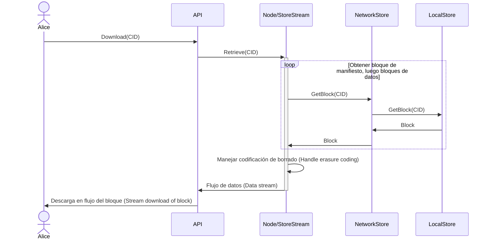
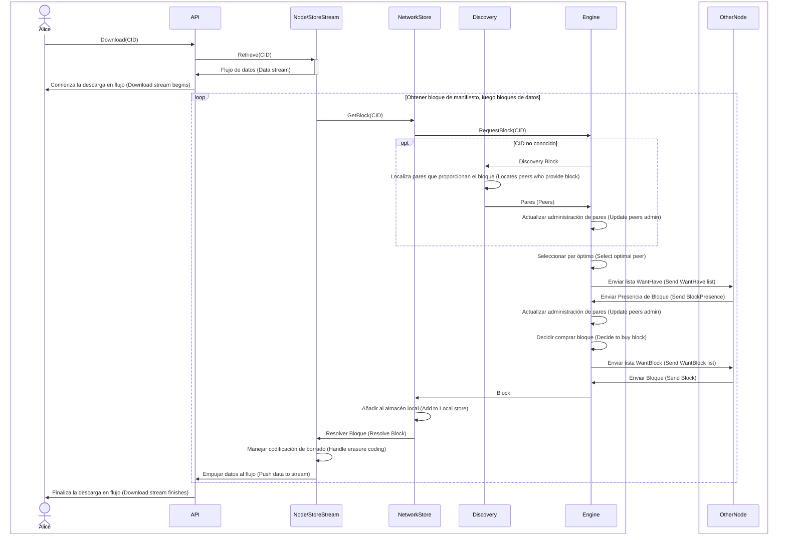

 Flujo de Descarga

Secuencia de interacciones que resultan en la transferencia de bloques de datos a través de la red.

## Almacén Local (Local Store)

Cuando los datos están disponibles en el almacén de bloques local (local blockstore),

## Almacén de Red
Cuando los datos no se encuentran en el almacén de bloques local, el motor de intercambio de bloques se utiliza para descubrir la ubicación del bloque dentro de la red. Se establecerá una conexión con el/los nodo(s) que tienen el bloque, y el intercambio puede tener lugar.

